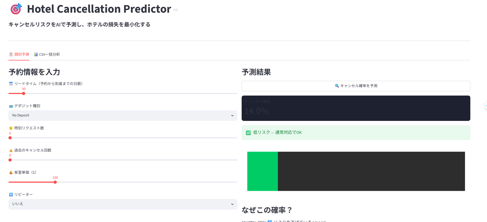

# Hotel Booking Cancellation Prediction
## キャンセルを予測してホテルの損失を減らす

[](https://www.kaggle.com/datasets/jessemostipak/hotel-booking-demand)
[](https://github.com/Nobumasa494/hotel-booking-cancellation)

---

## デモ画面



### アプリの起動方法
```bash
uv run streamlit run app.py
```

---

## 概要

119,390件のホテル予約データを使って、キャンセルを事前に予測する機械学習モデルを構築しました。

**キャンセル率37%という高い損失を、データで解決する**

---

## 使用技術

| カテゴリ | ツール |
|--------|------|
| 言語 | Python 3.x |
| データ分析 | pandas, numpy |
| 機械学習 | scikit-learn (Random Forest) |
| 可視化 | matplotlib, japanize-matplotlib |
| 環境 | Jupyter Notebook |

---

## データ

- **ソース**: [Hotel Booking Demand - Kaggle](https://www.kaggle.com/datasets/jessemostipak/hotel-booking-demand)
- **件数**: 119,390件
- **特徴量**: 32列（予約情報・顧客情報・部屋情報など）
- **キャンセル率**: 37%（業界平均20〜25%より高い）

---

## モデル性能

| 指標 | 値 |
|------|-----|
| AUC | **0.96** |
| Accuracy | 0.89 |
| Recall（キャンセル） | 0.82 |

---

## 主な発見

### キャンセルしやすい予約の特徴
1. **lead_timeが長い** — 遠い先の予約ほどキャンセルされやすい
2. **Non Refundプラン** — 返金なしなのにキャンセル率99%（代理店の一括処理が原因と推測）
3. **過去にキャンセル歴あり** — 1回でもキャンセル歴があると今回も94%がキャンセル
4. **特別リクエストが少ない** — リクエストが多い人ほど来る気がある

### 重要特徴量 Top5
| 順位 | 特徴量 | 意味 |
|------|--------|------|
| 1 | lead_time | 予約リードタイム |
| 2 | deposit_type_Non Refund | 返金なしプラン |
| 3 | country_PRT | ポルトガル国籍 |
| 4 | adr | 客室単価 |
| 5 | total_of_special_requests | 特別リクエスト数 |

---

## ビジネス提案

### ① オーバーブッキング戦略（最優先）
キャンセル確率が高い日は定員を超えて受け付ける。航空会社が一般的に使う手法。

### ② デポジット要求
キャンセル確率70%以上の予約にのみ前払いを求めてキャンセルを抑止する。

### ③ リマインドメール
キャンセル確率70%以上の予約にチェックイン1週間前にメールを送る。
※効果はA/Bテストで検証が必要

---

## ファイル構成

```
.
├── analysis.ipynb       # 分析・モデル構築
├── report.ipynb         # 考察・レポート
├── archive/
│   └── hotel_bookings.csv  # データ（要Kaggleダウンロード）
└── README.md
```

---

## 実行方法

```bash
uv run jupyter notebook
```

---

*データ分析学習中。フィードバック歓迎します。*
